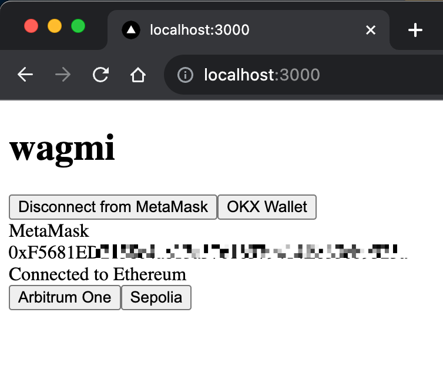

# Login with MetaMask

## TODO

- Add backend service.
- Sign message and log in.

## Getting Started

First, run the development server:

```bash
pnpm dev
```

Open [http://localhost:3000](http://localhost:3000) with your browser to see the result.


